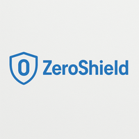

# 🛡️ ComplianceShield

### _Advanced Governance, Risk & Compliance Management System_

  
_ComplianceShield, a part of ZeroShield_

**License:** MIT | **Python** | **Django** | **React** | **TypeScript** | **TailwindCSS** | **Docker**

## 🚀 Sign Up for ComplianceShield

## Table of Contents

* Trial License & Security
* Paid Access
* About
* Core Mission
* Key Capabilities
* Security Frameworks & Methodologies
* Target Users
* Feature Overview  
   * 1\. Compliance Framework Management
   * 2\. Risk Management System
   * 3\. Privacy Detection & Analysis
   * 4\. Evidence Management
   * 5\. Audit Management
* Compliance Mapping
* Example Workflows & User Benefits
* Use Cases
* Tech Stack
* Case Studies
* Support
* Get Involved

---

## Trial License & Security

### Trial License Limits

* **Trial accounts** have a limit of up to **5 compliance assessments** per license period
* Upgrade to a full license for unlimited assessments and advanced features
* **Sign up for a trial account**

### Security Measures & Data Protection

ComplianceShield implements enterprise-grade security measures to protect your data and ensure the highest level of application security:

#### File Security

* **Antivirus scanning** is automatically performed on all file uploads to prevent malware transmission
* All uploaded files are scanned in real-time before processing

#### Application Security

* **OWASP** Top 10 for API Security **compliance** - ComplianceShield has been thoroughly tested against **OWASP** Top 10 for API Security vulnerabilities for application security
* **Two-Factor Authentication (2FA)** - Enhanced security for login and signup with 2FA verification
* **Secure authentication** with JWT tokens and encrypted session management
* **Input validation** and sanitization for all user inputs to prevent injection attacks

#### Data Privacy & Protection

* **No sensitive data storage** - Compliance evidence, audit data, and Personal Access Tokens submitted to the application are **never stored permanently**
* **Temporary processing only** - Sensitive data is used solely to initiate assessments and is immediately purged after analysis completion
* **Minimal data retention** - Only trivial information is retained for record-keeping:  
   * Project names (for compliance tracking)  
   * Organization names (for project identification)  
   * Assessment results (for compliance reporting)
* **Encrypted data transmission** using TLS 1.3 for all communications
* **Secure cloud infrastructure** with regular security audits and compliance certifications

---

## Paid Access

To learn more about our paid plans and pricing options, please contact our team:

📧 **Email**: support@zeroshield.ai

Our team will work with you to find the right plan for your organization's needs.

**Get started with a trial account** to experience ComplianceShield today!

---

## About ComplianceShield

**ComplianceShield** is an advanced governance, risk, and compliance management platform within the **ZeroShield** ecosystem, designed to give organizations deep, actionable insight into compliance across multiple frameworks, risk management, and automated auditing processes. ComplianceShield unifies real-time compliance monitoring, privacy impact assessments, and comprehensive risk management for a complete, **compliance**-ready view of your organizational security posture.

---

## Core Mission

Empower organizations to rapidly identify, understand, and remediate compliance gaps and risks—across all frameworks—by automating compliance assessments, risk analysis, and evidence management. ComplianceShield bridges the gap between governance requirements, risk management, and operational compliance, enabling secure and compliant digital operations.

---

## Key Capabilities

* Automated Compliance Framework Management for multiple standards (ISO 27001, GDPR, PCI DSS, SOC2, NIST, HIPAA)
* Advanced Risk Management with automated risk identification and scoring
* Privacy Detection & Analysis with automated PIA, DPIA, and RoPA generation
* Evidence Management with approval workflows and compliance mapping
* Audit Management with automated auditor assignment and review processes
* AI-Powered Compliance Assistance through intelligent chatbot integration

---

## Security Frameworks & Methodologies

### Compliance Frameworks Supported

| Framework | Status | Coverage | Key Features |
|-----------|--------|----------|--------------|
| **ISO 27001:2022** | ✅ Supported | Complete | Information Security Management |
| **GDPR** | ✅ Supported | Complete | Data Protection & Privacy |
| **PCI DSS** | ✅ Supported | Complete | Payment Card Industry Security |
| **SOC2** | ✅ Supported | Complete | Service Organization Controls |
| **NIST** | ✅ Supported | Complete | Cybersecurity Framework |
| **HIPAA** | ✅ Supported | Complete | Healthcare Data Protection |

### Risk Management Methodologies

* **Risk Assessment**: Automated likelihood and impact scoring
* **Risk Mitigation**: Action item tracking and progress monitoring
* **Risk Reporting**: Comprehensive risk dashboards and analytics
* **Compliance Mapping**: Direct mapping of risks to compliance controls

---

## Target Users

* **Compliance Officers** - Streamline compliance management across multiple frameworks
* **Risk Managers** - Automated risk identification and mitigation tracking
* **Auditors** - Efficient audit workflows and evidence management
* **Security Teams** - Privacy impact assessments and security compliance
* **Executive Leadership** - Comprehensive compliance and risk dashboards

---

## Feature Overview

### 1. Compliance Framework Management

**Automated Multi-Framework Support**

ComplianceShield provides comprehensive support for major compliance frameworks including ISO 27001, GDPR, PCI DSS, SOC2, NIST, and HIPAA. The system automatically maps organizational controls to framework requirements and tracks compliance progress in real-time.

**Key Features:**
* **Framework Integration**: Pre-loaded compliance frameworks with clause and sub-clause structures
* **Progress Tracking**: Real-time compliance status across all frameworks
* **Gap Analysis**: Automated identification of compliance gaps and remediation steps
* **Evidence Mapping**: Direct linking of evidence to specific compliance controls

### 2. Risk Management System

**Intelligent Risk Assessment & Mitigation**

The platform provides automated risk identification, assessment, and mitigation tracking with comprehensive reporting capabilities.

**Key Features:**
* **Risk Identification**: Automated and manual risk registration
* **Risk Scoring**: Likelihood and impact assessment algorithms
* **Mitigation Tracking**: Action item management and progress monitoring
* **Risk Reporting**: Executive dashboards and detailed risk analytics

### 3. Privacy Detection & Analysis

**Automated Privacy Compliance Assessment**

ComplianceShield includes advanced privacy detection capabilities with automated generation of Privacy Impact Assessments (PIA), Data Protection Impact Assessments (DPIA), and Records of Processing Activities (RoPA).

**Key Features:**
* **PIA Generation**: Automated Privacy Impact Assessment creation
* **DPIA Analysis**: Data Protection Impact Assessment automation
* **RoPA Creation**: Records of Processing Activities generation
* **Code Analysis**: Automated code review for privacy vulnerabilities
* **Application Security**: Comprehensive security analysis for mobile and web applications

---

## Compliance Mapping

| Compliance Area | ISO 27001 | GDPR | PCI DSS | SOC2 | NIST | HIPAA |
|-----------------|-----------|------|---------|------|------|-------|
| Data Protection | ✓ | ✓ | ✓ | ✓ | ✓ | ✓ |
| Access Control | ✓ | ✓ | ✓ | ✓ | ✓ | ✓ |
| Risk Management | ✓ | ✓ | ✓ | ✓ | ✓ | ✓ |
| Incident Response | ✓ | ✓ | ✓ | ✓ | ✓ | ✓ |
| Audit & Monitoring | ✓ | ✓ | ✓ | ✓ | ✓ | ✓ |
| Privacy Controls | ✓ | ✓ | ✓ | ✓ | ✓ | ✓ |

_Each compliance area is automatically mapped across frameworks using intelligent analysis and compliance metadata. Compliance impact is shown per control and in summary dashboards._

---

## Example Workflows & User Benefits

**Compliance Management Workflow:**

* Create compliance projects for specific frameworks, upload evidence, track progress, generate compliance reports, and maintain audit readiness.
* Dashboard instantly shows compliance status, failed controls, and actionable remediation steps.

**Risk Management Workflow:**

* Register risks, assess likelihood and impact, assign mitigation actions, track progress, and generate risk reports.
* Risk manager identifies new risks; dashboard highlights high-priority items and tracks mitigation progress.

**Privacy Assessment Workflow:**

* Initiate privacy scans, review findings, generate PIA/DPIA reports, implement recommendations, and maintain privacy compliance.
* Privacy officer triggers assessment; system generates comprehensive privacy reports with actionable recommendations.

**Benefits:**

* Prevent compliance failures and regulatory violations before they happen.
* Save time with automation and intelligent guidance.
* Communicate compliance status and progress clearly to all stakeholders.

---

## Use Cases

* Multi-framework compliance management for enterprise organizations
* Continuous compliance monitoring (ISO, PCI, NIST, SOC2, GDPR, HIPAA)
* Risk management and mitigation tracking
* Privacy impact assessments and data protection compliance
* Audit preparation and evidence management
* Regulatory reporting and compliance documentation

---

## Tech Stack

* **Backend:** Python (Django), REST API, JWT Auth
* **Frontend:** React (TypeScript), Tailwind CSS, Chart.js, React Router
* **AI Analysis:** LLM/AI-powered compliance analysis and risk assessment
* **Compliance Analysis Methods:** Automated framework mapping and gap analysis
* **Database:** Enterprise database with caching layer

---

## Case Studies

A public repository of case studies and technical deep-dives are available below, demonstrating ComplianceShield's real-world impact across various compliance domains.

* **Case Study 1: Achieving ISO 27001 Compliance for a Financial Services Organization**  
   * View Source Documentation  
   * **View Full Report**
* **Case Study 2: GDPR Compliance Assessment for a Healthcare Platform**  
   * View Source Documentation  
   * **View Full Report**

---

## Support

* 📧 Contact: tarun@zeroshield.ai
* 📧 Support Queries: support@zeroshield.ai

---

> **Value Proposition:**  
> Unified, automated compliance and risk management for the next generation of enterprise governance "ComplianceShield turns complex, manual compliance and risk challenges into automated, actionable insights—empowering organizations to move faster, safer, and with confidence."_ComplianceShield, a part of ZeroShield, brings in-depth, practical compliance management to every step of your governance and risk management lifecycle._

---

## Get Involved

We welcome contributions from the compliance and security community! Here's how you can get involved with ComplianceShield:

### 🚀 Get Started

**Sign up for ComplianceShield** to start managing your compliance today!

### 🤝 Contributing

* **Report Issues**: Found a bug or have a feature request? Open an issue on our repository
* **Code Contributions**: Submit pull requests to help improve ComplianceShield
* **Documentation**: Help improve our documentation and examples
* **Compliance Research**: Contribute new compliance frameworks, risk models, or assessment techniques

### 🔗 Community

* **GitHub Discussions**: Join our community discussions and share ideas
* **Compliance Research**: Collaborate on new compliance analysis techniques
* **Feedback**: Share your experience using ComplianceShield in your organization

### 📞 Contact

* **General Contact**: tarun@zeroshield.ai
* **Support**: support@zeroshield.ai

---

All rights reserved. This software and its documentation are the intellectual property of ZeroShield.

---

## About

 ComplianceShield is a unified, AI-powered compliance management platform from zeroshield.ai. It is an advanced compliance tool built to perform governance, risk, and compliance management for enterprise organizations across multiple frameworks.

zeroshield.ai 

### Topics

 python  django  react  compliance  risk-management  governance  privacy-detection  audit-management  iso27001  gdpr  pci-dss  soc2  nist  hipaa  fastapi  compliance-automation  ai-powered  grc-platform 

### Resources

 Readme 

###  Uh oh!

There was an error while loading. Please reload this page.

Activity 

### Stars

**0** stars 

### Watchers

**0** watching 

### Forks

**0** forks 

 Report repository 

## Releases

No releases published   

## Packages

 No packages published   

## Contributors

* @CyberUltron-tarun **CyberUltron-tarun**

## Footer

 © 2025 GitHub, Inc. 

### Footer navigation 

* Terms
* Privacy
* Security
* Status
* Community
* Docs
* Contact
* Manage cookies
* Do not share my personal information

 You can't perform that action at this time.

